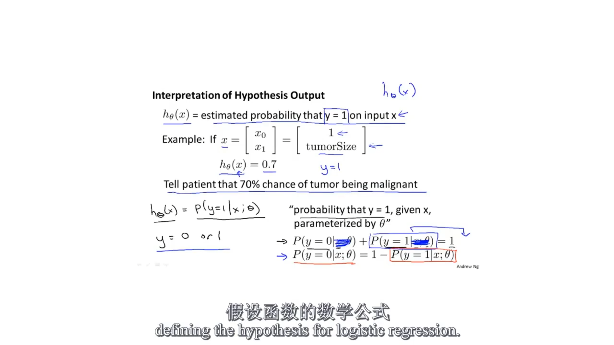
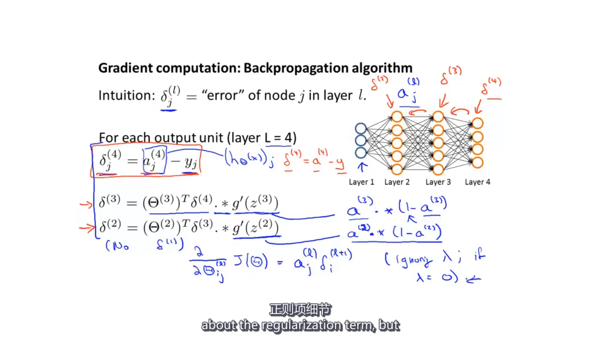
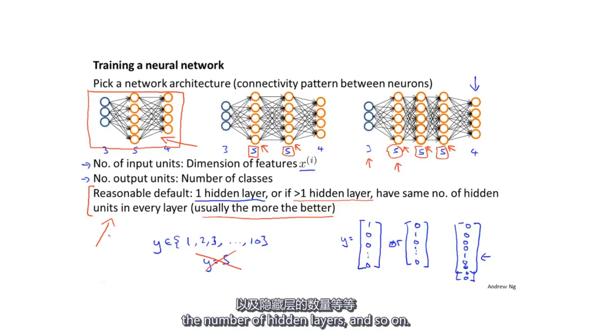

监督学习

一元线性回归

将训练集中的数据拟合至hθ(x)=θ0+θ1x

梯度下降法

alpha (learning rate) means the speed of downhill

通过特征缩放，使所有特征大小保持在一个范围内，提高梯度下降的效率

通常缩放公式使用 （多元线性回归）（μ：平均值）

根据代价函数(cost function)的定义，J(θ)最小时，θ的取值即为所求

即cost function取极小值，根据函数定义此时导数值为0

求解代价函数中θ的值，即求解d J(θ)/dθ=0 ==\> θ0,θ1…,θn

θ=（XTX）-1XTy (推导，假定X可逆)（注：此公式适用于不可逆矩阵，可逆矩阵可直接通过(1)计算）

=X-1(XT)-1XTy

=X-1y （1）

即

Xθ=y(解矩阵方程组)(X为矩阵，由训练集组成)(θ为待求向量）

善用矩阵

Logistic Regression(classitication)

Sigmoid函数:

令hθ(X)=g(θTx)=

条件概率：设A、B是两个事件，且P(A)\>0，则称P(B\|A)=为事件A发生的条件下，事件B的条件概率。

hθ(x)=P(y=1\|x;θ)在肿瘤的实例中可以解释为假设肿瘤为恶性肿瘤，则在当前x(θ)的条件下成立的概率是多少

Logistic regression cost function

Note: y=0 or 1 always

写作：

When y=0:*  
*

When y=1:

最终形式：

\*来自统计学中极大自然估计的方法

利用梯度下降法：

★★★

逻辑回归中多分类问题解决方案：

每次仅关注一个小类，对小类（对此类以外的数据看作负类）进行逻辑回归，最终得到多个逻辑回归模型，作为分类标准

减少欠拟合或过拟合的情况：

正则化：

如果某些参数值应该较小，则在代价函数中增大参数的代价，使其达到正常值

在代价函数中对每个参数增加惩罚项，使所有参数的值均降低（θ0均可）

λ用于平衡代价函数左侧和右侧

正规式形式的正则化

(XTX)-1XT可以求的不可逆矩阵的伪逆矩阵

神经网络

\--非线性分类问题

输入层-\>隐藏层-\>输出层

L：神经网络中总层数

sl：l层中神经单元的个数（不包括偏置单元）

神经网络代价函数：

注：将所有的 θ均考虑入该表达式

反向传播算法：

即先根据最后一层的结果计算该层的δ

根据已知结果求出上一层δ

最终求出所有层的代价函数

根据代价函数求出最后参数值

δ(l), δ(l-1), δ(l-2),…, δ(2)

Backpropagation algorithm

反向传播算法最终求出的是cost function的偏导数项

神经网络算法：

1 预设θ

2 根据数据集正向计算各级a的值

3 根据算法求出δ(l), δ(l-1), δ(l-2),…, δ(2)

4 根据已有数据求的各级Δ的值

5 根据Δ求出cost function的偏导数项

6 根据求出的偏导数项使用梯度下降法或其他算法求出最佳θ代入神经网络算法中，完成算法训练

梯度测试：对前向传播和后向传播的结果进行检测，使梯度下降或其他算法的结果保持正确

从数值上估算偏导数的值，与梯度下降或其他算法得到的偏导数值进行比较，进行评估

Check the 算法结果≈估测结果

参数初始化时不应使参数相同（均为0），会导致权重经过迭代后依旧相同，出现错误（所有的神经单元均在计算相同的特征值）

使用随机初始化参数的方式

注：此处ε与梯度检测中的ε无关，为数学概念

设计：

1 确定输入单元数

2 确定输出单元数（与最终分类结果有关）

3 隐藏层：默认设置为1；若超过1，则每个隐藏层的节点数目应该相同

算法实现过程：

评价训练效果

将数据集按7:3进行划分，用70%的数据（训练集training set）进行模型计算，用30%的数据（测试集test set）进行验证

通过对测试集的结果进行度量来评估算法的好坏

步骤：

1 通过training set求出θ-\>hθ(x)

2 通过test set对hθ(x)求误差，进行判断

0/1错误分类法：

Data set = (training set, validation set, test set) (6:2:2)

以上方法仅能证明对test set的拟合程度好，无法证明对未知的数据可以更好的拟合

因此，将data set设置为三部分

用数据集进行参数训练，用cross validation set进行参数评估进而选择模型，用test set设置泛化误差作最终结果

欠拟合/过拟合 判断方法—偏差/方差

根据对训练集的cost function与交叉验证集的cost function进行验证得到underfit(high bias)/overfit(high variance)

关于λ的选择：

λ大小选择所产生的影响：

Learning curves：用于检查算法是否存在偏差/方差问题

高偏差情况：Jcv≈Jtrain is so high

高方差情况：Jcv-Jtrain is petty high(limit m)

高方差情况下增大训练集可以提高算法的准确度

大型神经网络的潜在问题是过拟合问题，可以通过操作λ解决相关问题

误差分析

算法实现过程：

1 实现一个简单的算法，效果高低不重要

2 根据实现的算法的情况对算法进行改进，可以通过算计计算的方法进行判断是否进行方法的改进（误差分析），也可以通过绘制学习曲线的方式进行修正

Skew classes

Question：如果患癌症的人仅有0.5%，那么使用非机器学习算法y=0的错误率仅有0.5%，甚至优于机器学习算法。

Answer：引入两个参数Precision（查准率）和Recall（召回率）用于评估算法效果

|                 | Actual class |                |                |
|-----------------|--------------|----------------|----------------|
| Predicted class |              | 1              | 0              |
|                 | 1            | True positive  | False positive |
|                 | 0            | False negative | True negative  |

Precision（预测成功/预测总数）（预测成功准确率）（越高越好）

=

预测为1，预测样本确实为1占比

Recall（预测成功/实际人数）

=

预测为1，实际确实为1占比

对Precision(P) and Recall(R) 进行评估的方法

F Score: 2\*

结合平均值和权重的公式（choose the higher lever）

P=0 or R=0 F.score = 0

P=1 and R=1 F.score = 1

通过增加参数数量使算法拥有较低的偏差

通过使用大的训练集使算法拥有较低的方差

多参数+大数据集≈好算法
